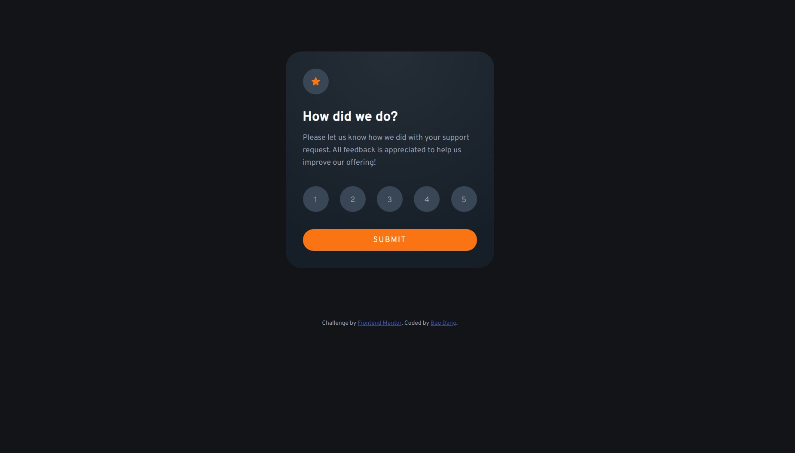

# Frontend Mentor - Interactive rating component solution

## Table of contents

- [Overview](#overview)
  - [The challenge](#the-challenge)
  - [Screenshot](#screenshot)
  - [Links](#links)
- [My process](#my-process)
  - [Challenges](#challenges)
  - [What I learned](#what-i-learned)
  - [Built with](#built-with)
- [Author](#author)

## Overview

- This is a simple interactive rating interface.

### Screenshot

### Links

- Solution URL: [Frontend Mentor](https://www.frontendmentor.io/solutions/sass-and-radio-buttons-learned-oUwSVehoQY)
- Live Site URL: [Article Preview](https://weebao.github.io/interactive-rating-component-main/)

## My process

- I wanted to try Sass and see how it is different from SCSS so I looked up the formatting and basic Sass functions.
- I began adding HTML components and styling them right away with Sass.
- After figuring out how to switch between the input and result menus, I worked with the buttons using JavaScript.

### Challenges

- The first challenge was how to keep the result of the rating buttons in order to display it on the result menu. I was thinking of using JavaScript to listen for `onClick` event and label the button with selected while unselecting the previously selected button. I figured out a better way is to use radio buttons of HTML, which is more convenient since I don't have to use JavaScript to unselect the other buttons.
- The second challenge is how to deploy the result menu. I was thinking of creating a new HTML file for the result menu which was quite tedious but I figured out another way is to use Sass and label the result menu with `display: none`.

### Built with

- HTML
- Sass
- JavaScript

## Author

- Website - [Bao Dang](https://github.com/weebao)
- Frontend Mentor - [@Bao Dang](https://www.frontendmentor.io/profile/weebao)
